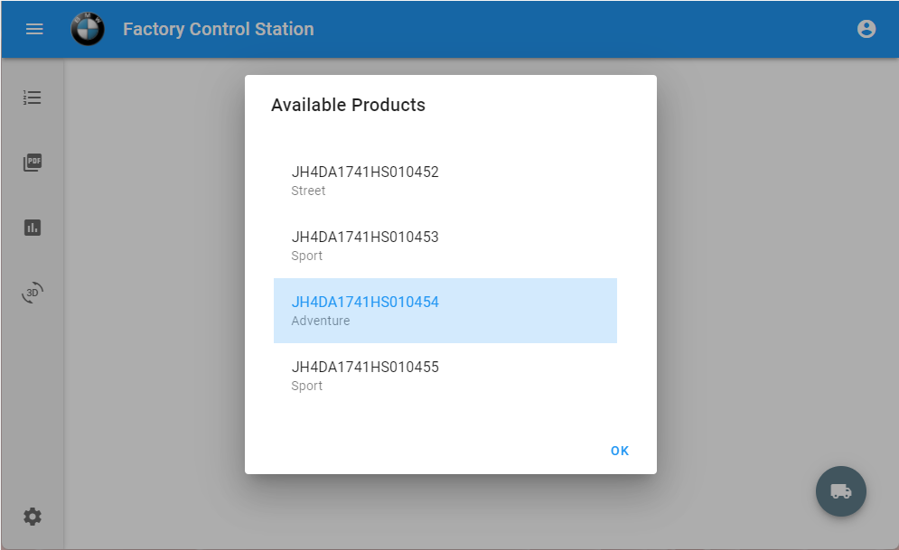
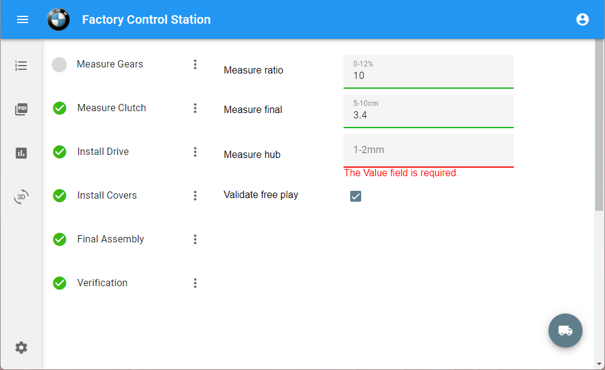
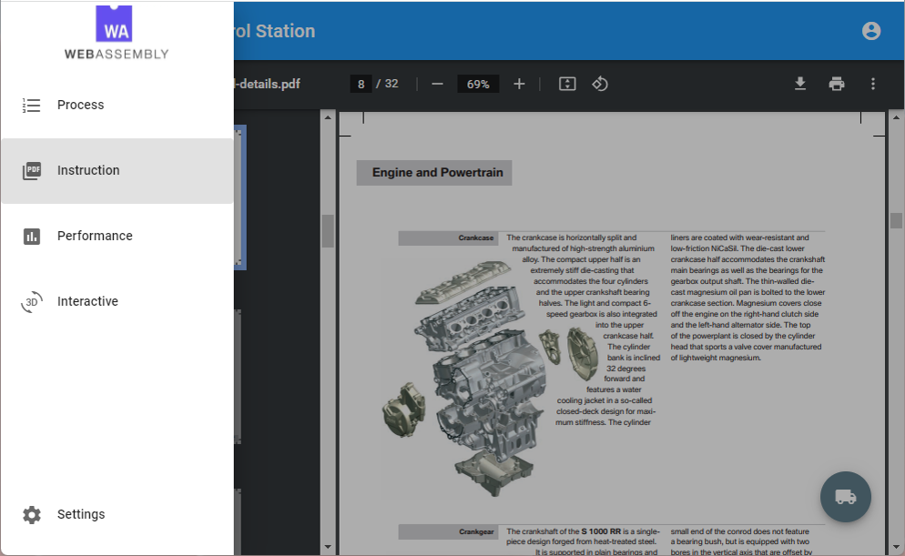

# Blazor.ControlSystem

Clone repo and open the .sln with VS2019+. Ensure you have the latest .Net Core Blazor extensions

A live version is available on my GitHub pages https://jeffbarnard.github.io/Blazor.ControlSystem/

